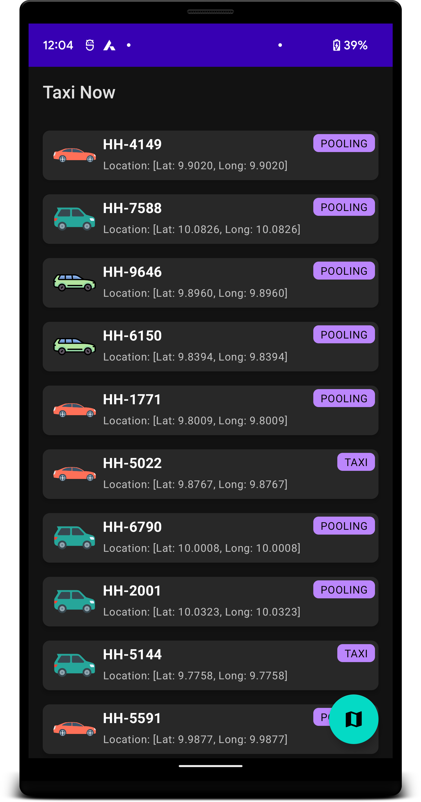
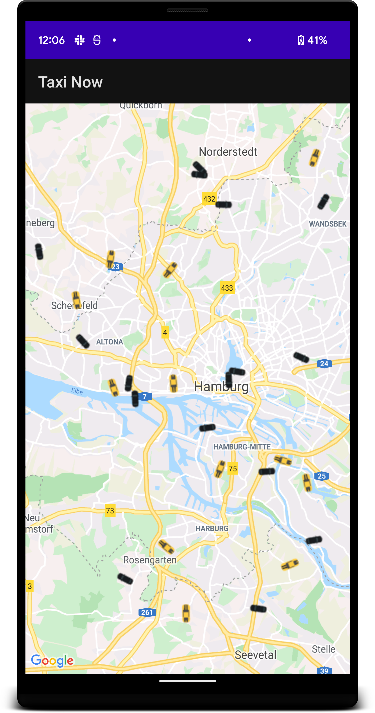
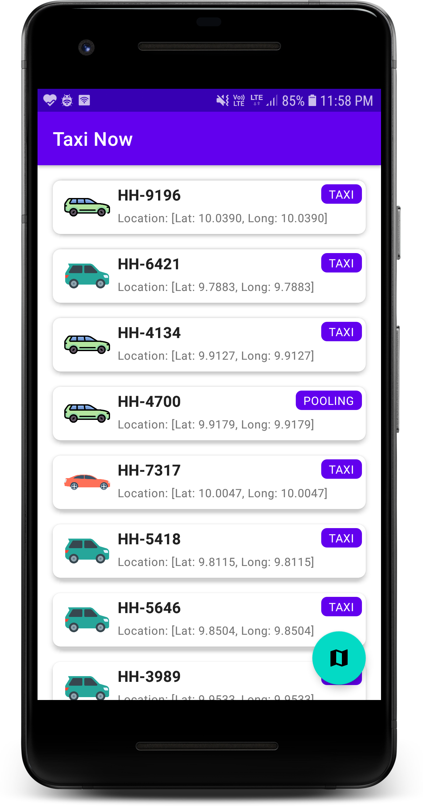
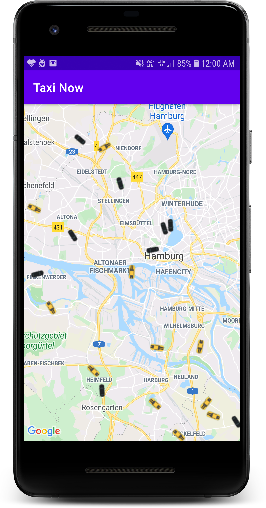

Taxi Now
======================

Taxi Now is an android app to view near by available Taxi.

## Functional Requirment
* User can view list of available taxi in Hamburg City.
* User can view available taxi in Hamburg City on Google Map.

## Non-Functional Requirment
* Ligh and Dark model support.
* Unit test cases.
* UI Authomation test cases.
* CI/CD to build and release new binary.

## Assumptions
* This application will support only ONLINE mode.
* No data will be store in device.

## Client-Server Communication
* Mobile application will communicate with backend server through REST Http APIs.

### APIs
| API Name         | Endpoint                                                                                                   | Type  |
| ---------------- |:----------------------------------------------------------------------------------------------------------:| -----:|
| Get Vehicles     | https://fake-poi-api.mytaxi.com/?p1Lat={Latitude1}&p1Lon={Longitude1}&p2Lat={Latitude2}&p2Lon={Longitude2} | GET   |

## Data Models

## Screenshots

  
  
  
  

## Architecture
The architecture is built around [Android Architecture Components](https://developer.android.com/topic/libraries/architecture/) and follows the recommendations laid out in the [Guide to App Architecture](https://developer.android.com/jetpack/docs/guide). Logic is kept away from Activities and Fragments and moved to [ViewModel](https://developer.android.com/topic/libraries/architecture/viewmodel)s. Data is observed using [Kotlin Flows](https://developer.android.com/kotlin/flow/stateflow-and-sharedflow) and the Repository layer handles data operations.

## Kotlin

The app is entirely written in Kotlin and uses Jetpack's [Android Ktx extensions](https://developer.android.com/kotlin/ktx).

Asynchronous tasks are handled with [coroutines](https://developer.android.com/kotlin/coroutines). Coroutines allow for simple and safe management of one-shot operations as well as building and consuming streams of data using [Kotlin Flows](https://developer.android.com/kotlin/flow).

## Tools

- Android Studio Arctic Fox | 2020.3.1 Patch 4
- Kotlin (version 1.6.0)
- Gradle (version 7.0.4)

## Libraries
* [Architecture](https://developer.android.com/jetpack/arch/) - A collection of libraries that helps to design robust, testable, and
  maintainable apps.
  * [Lifecycles](https://developer.android.com/topic/libraries/architecture/lifecycle) - Create a UI that automatically responds to lifecycle events.
  * [ViewModel](https://developer.android.com/topic/libraries/architecture/viewmodel) - Store UI-related data that isn't destroyed on app rotations. Easily schedule
     asynchronous tasks for optimal execution.
  * [Flow](https://developer.android.com/kotlin/flow) - Flow API to handle the stream of data asynchronously that executes sequentially.
  * [Hilt](https://developer.android.com/training/dependency-injection/hilt-android) - for [dependency injection](https://developer.android.com/training/dependency-injection)
  * [Kotlin Coroutines](https://kotlinlang.org/docs/reference/coroutines-overview.html) - for managing background threads with simplified code and reducing needs for callbacks.  
* [UI](https://developer.android.com/guide/topics/ui) - Details on why and how to use UI Components in your apps - together or separate
  * [Material](https://material.io/develop/android) - Material Components for Android
  * [Splash](https://developer.android.com/guide/topics/ui/splash-screen) - App startup screen
* Third party and miscellaneous libraries
  * [Retrofit](https://square.github.io/retrofit/) - A type-safe HTTP client for Android and Java
  * [Lottie](https://lottiefiles.com/) - for showing animated icons and images.
* Testing
  * [Mockk](https://mockk.io/) - Mocking library for Kotlin.
  * [Espresso Android](https://developer.android.com/training/testing/espresso) Use Espresso to write concise, beautiful, and reliable Android UI tests.
